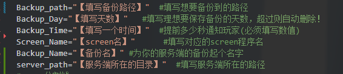

#### [返回](../README.md)|[服务器快速部署脚本](../deploy/README.md)|[服务器维护脚本](README)|[服务器日志保存脚本](../save_log/README.md)|[服务器启动脚本](../server_script/README.md)
# 我的世界服务器自动备份脚本 Test  
> **本项目Windows版还没有开发**  
> **如果你有开发能力你可以为本项目提交pr**  

## 可配置项(Linux)

## 注意事项
> **建议复制后粘贴到空白文档保存到指定编码以免遇到编码问题**  
> **Windows脚本用`ANSI`编码，Linux脚本用`UTF-8`编码**  
> **Linux脚本记得赋予可执行权限方可执行;赋予可执行权限命令 chmod 777 <想要赋予可执行权限的程序>**  